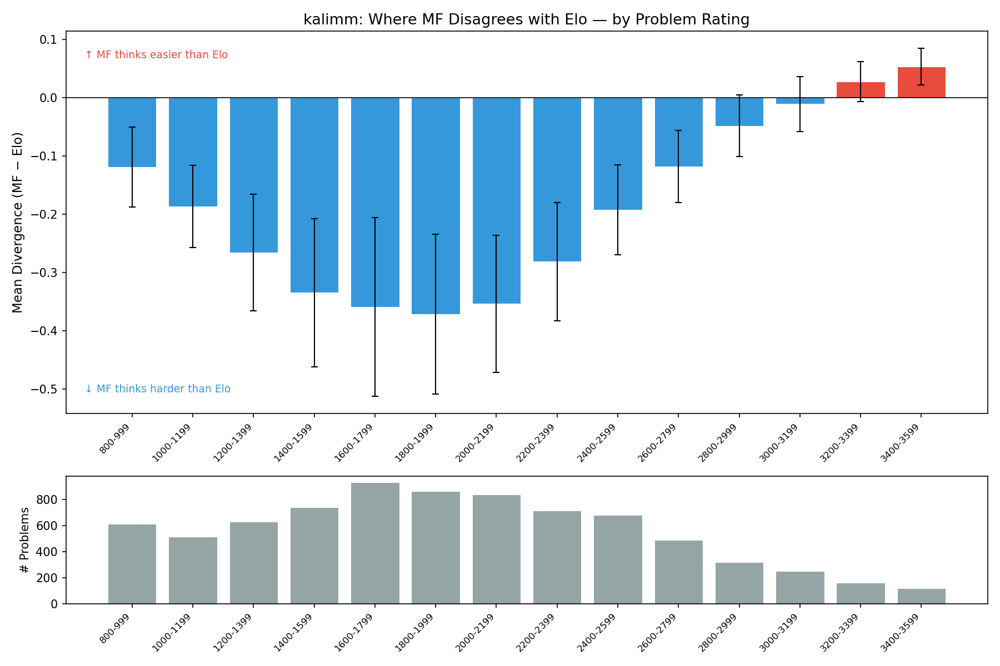
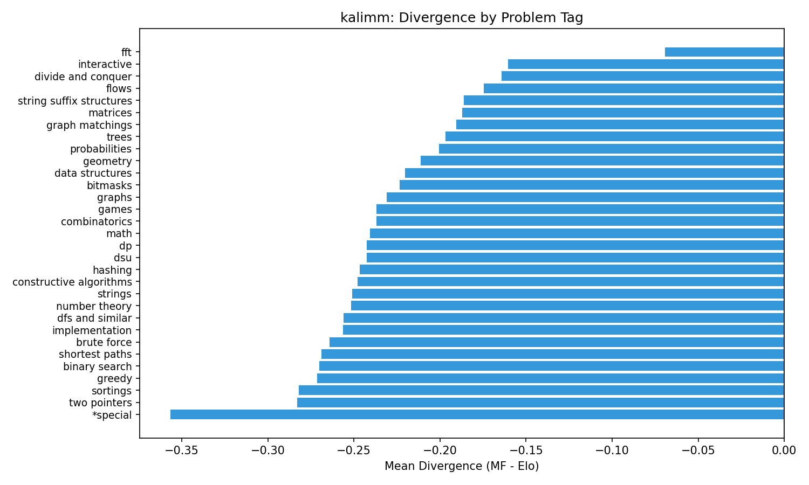
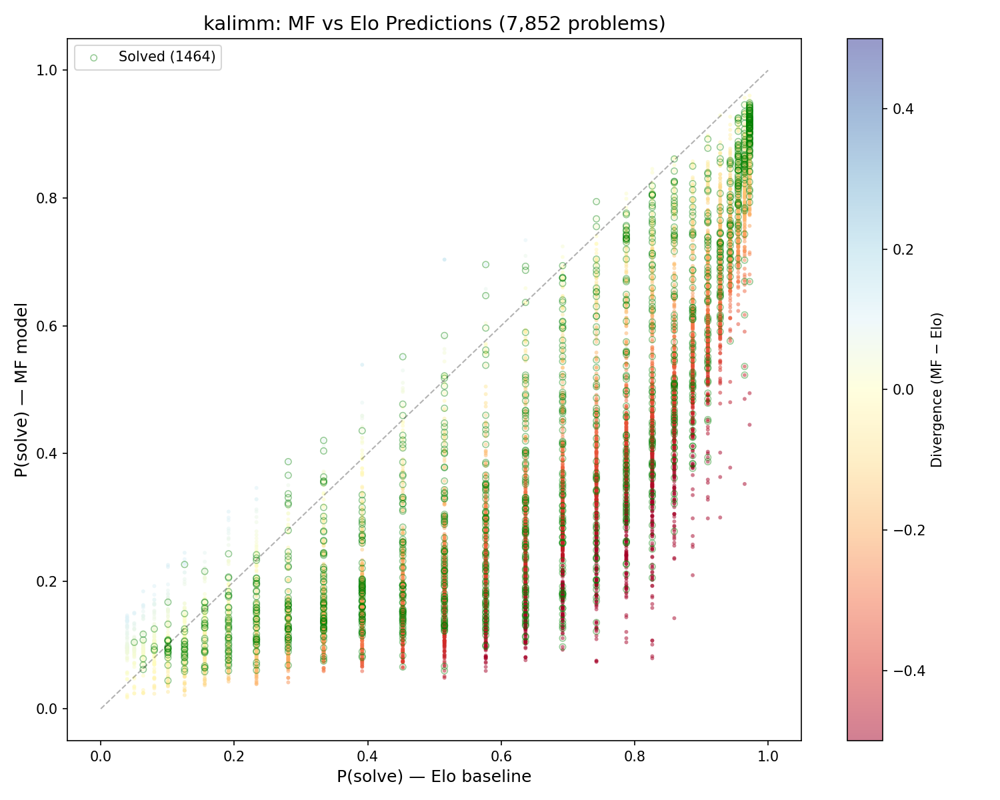
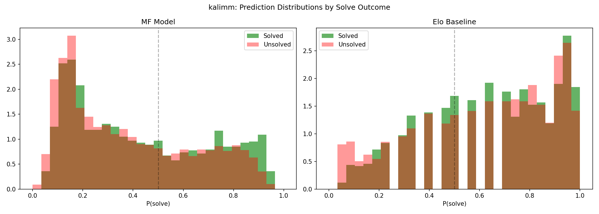

# MF vs Elo Divergence Analysis: Case Study (kalimm)

User **kalimm** (CF rating 2224) — 2,121 submitted problems in the model (1,961 solved), 12,425 total problems scored.

Model: logistic MF with k=30, 100 epochs, trained on all data (~2,000 contests, 2010–2025), kalimm excluded from training. User embedding fitted on-the-fly via `fit_user_weighted` with time-decay weighting.
Elo baseline: P(solve) = sigma((user_rating - problem_rating) / 400).

**Divergence** = P(solve)_MF - P(solve)_Elo. Negative means MF thinks the problem is harder for this user than Elo does.

## Summary Statistics

| Metric | Value |
|--------|-------|
| Mean divergence | -0.246 |
| Std dev | 0.160 |
| MF harder (div < -0.1) | 6,171 / 7,852 (78.6%) |
| MF easier (div > +0.1) | 22 / 7,852 (0.3%) |
| Agree (\|div\| < 0.1) | 1,657 / 7,852 (21.1%) |

MF systematically predicts lower solve probabilities than Elo for this user. This is not a bug — it reflects the MF model's ability to detect skill-specific weaknesses that a single-number rating cannot capture.

## Key Finding: MF Is More Accurate When They Disagree

When MF and Elo predict on opposite sides of 0.5 (one says "likely solve", the other says "likely fail"):
- **2,935 problems** (37.4% of all) have this directional disagreement
- MF is correct **82.8%** of the time
- Elo is correct **17.2%** of the time

This is the strongest evidence that MF captures genuine skill structure that Elo misses.

## Calibration

|  | Solved (n=1,464) | Unsolved (n=6,388) |
|--|-------------------|---------------------|
| MF predicts p > 0.5 | 554 (37.8%) | 2,027 (31.7%) |
| Elo predicts p > 0.5 | 1,054 (72.0%) | 4,452 (69.7%) |
| MF predicts p < 0.5 | 910 (62.2%) | 4,361 (68.3%) |
| Elo predicts p < 0.5 | 410 (28.0%) | 1,936 (30.3%) |

Elo is optimistic: it predicts p > 0.5 for 72% of solved problems but also for 70% of *un*solved problems — it barely discriminates. MF is conservative: it predicts p > 0.5 for only 38% of solved problems, but correctly predicts p < 0.5 for 68% of unsolved problems. MF sacrifices recall on solved problems to gain much better specificity on unsolved ones.

For a recommendation system, this conservatism is desirable — it's better to recommend problems the user can actually solve than to suggest problems that appear "in range" by rating but are actually skill gaps.

## Divergence by Problem Rating

| Rating Band | Mean Div | n |
|-------------|----------|---|
| 800-999 | -0.119 | 613 |
| 1000-1199 | -0.187 | 514 |
| 1200-1399 | -0.266 | 627 |
| 1400-1599 | -0.335 | 739 |
| **1600-1799** | **-0.360** | **932** |
| **1800-1999** | **-0.372** | **862** |
| 2000-2199 | -0.354 | 839 |
| 2200-2399 | -0.282 | 715 |
| 2400-2599 | -0.193 | 679 |
| 2600-2799 | -0.118 | 489 |
| 2800-2999 | -0.049 | 316 |
| 3000-3199 | -0.011 | 250 |
| 3200-3399 | +0.027 | 160 |
| 3400-3599 | +0.053 | 117 |

The divergence follows an inverted-U shape:
- **At easy ratings (800-1000)**: Both models agree — these problems are solvable. Low divergence.
- **At mid-range ratings (1400-2000)**: Maximum divergence (-0.37). Elo says "slightly above 50/50" but MF says "actually hard for you." These are the problems where skill composition matters most — a 2200-rated user might crush 1800-rated DP problems but struggle with 1800-rated geometry.
- **At hard ratings (2800+)**: Both models agree the problems are hard. Near zero divergence. At 3200+, MF actually predicts *slightly easier* than Elo — the model detects that kalimm has specific strengths in certain hard problem types.

This is exactly what you'd expect from a model that captures latent skills: the rating-centered "zone of uncertainty" (problems where a user's rating alone can't predict success) is where MF adds the most value.

## Divergence by Problem Tag

### Tags where MF thinks much harder than Elo

| Tag | Mean Div | n | Interpretation |
|-----|----------|---|----------------|
| `*special` | -0.357 | 323 | Unusual/non-standard problems — MF learns these are genuinely different |
| `two pointers` | -0.283 | 340 | Technique kalimm may not practice often |
| `sortings` | -0.282 | 714 | Often paired with greedy/implementation — problem-specific difficulty |
| `greedy` | -0.272 | 1,853 | Large tag, high divergence — many greedy problems have hidden traps |
| `binary search` | -0.270 | 735 | Elo overpredicts; MF captures that applying binary search varies widely |

### Tags where MF roughly agrees with Elo

| Tag | Mean Div | n | Interpretation |
|-----|----------|---|----------------|
| `fft` | -0.069 | 54 | Specialized topic — if you know FFT, you know FFT. Rating correlates well. |
| `interactive` | -0.161 | 123 | Novel format, but rating-correlated difficulty |
| `divide and conquer` | -0.164 | 185 | Clean algorithmic topic with less variance |
| `flows` | -0.175 | 104 | Specialized — skill or no skill, little in-between |

The pattern: **specialized/advanced topics** (FFT, flows, D&C) have low divergence because they're binary — you either know the technique or you don't, and your rating roughly captures that. **Broad/common topics** (`*special`, greedy, implementation, brute force) have high divergence because they encompass huge difficulty variance that rating alone can't capture.

## The `*special` Problem

The `*special` tag deserves special attention as the highest-divergence category:

- **323 problems**, mean rating 1714
- **Only 26 solved** (8.0%) despite mean Elo prediction of 0.735
- MF mean prediction: 0.379 — much closer to the true solve rate
- These are typically early CF contest problems (IDs in the hundreds) with unusual formats, multiple subtasks (e.g., 207:D5, 207:D7), or non-standard scoring

Elo sees a 1714-rated problem and says "kalimm (2224) should solve 73% of these." MF has learned from the training data that `*special` problems are solved at dramatically lower rates than their rating suggests, and adjusts downward. The true solve rate (8%) vindicates MF's skepticism.

## Case Studies: Most Divergent Problems

### MF thinks much harder than Elo

| Problem | Rating | MF | Elo | Div | Tags | Solved |
|---------|--------|-----|-----|-----|------|--------|
| 207:D7 | 1600 | 0.079 | 0.826 | -0.747 | (none) | No |
| 206:D7 | 1600 | 0.082 | 0.826 | -0.744 | (none) | No |
| 171:G | 1600 | 0.101 | 0.826 | -0.726 | `*special` | No |
| 190:C | 1500 | 0.142 | 0.859 | -0.717 | `dfs and similar` | No |
| 199:D | 1400 | 0.209 | 0.887 | -0.678 | `dfs and similar; shortest paths` | No |

All are from early CF contests (IDs 130-207). Many have subtask naming (D5, D7) indicating multi-part problems. All unsolved. Elo says "trivially solvable" (p > 0.8); MF says "actually very hard for you" (p < 0.2). MF is correct every time.

These problems likely have anomalous difficulty relative to their assigned rating — they were rated before CF's rating system matured, or their subtask structure makes them harder than a single rating suggests.

### MF thinks easier than Elo (rare)

| Problem | Rating | MF | Elo | Div | Tags | Solved |
|---------|--------|-----|-----|-----|------|--------|
| 1261:D1 | 2200 | 0.704 | 0.515 | +0.189 | `combinatorics; dp` | No |
| 1261:D2 | 2400 | 0.539 | 0.392 | +0.147 | `combinatorics; fft; math; number theory` | No |
| 1286:D | 3100 | 0.225 | 0.101 | +0.125 | `data structures; math; matrices; probabilities` | No |
| 1439:D | 3100 | 0.222 | 0.101 | +0.121 | `combinatorics; dp; fft` | No |
| 1158:C | 2100 | 0.696 | 0.577 | +0.119 | `constructive algorithms; data structures; dfs and similar; graphs; greedy; math; sortings` | Yes |

Only 22 problems in the entire set have divergence > +0.1. These tend to be hard problems (2200-3300) with `combinatorics`, `dp`, `fft`, and `data structures` tags. MF has detected that kalimm has relative strength in these areas — the latent embedding captures a skill profile that rates higher on these dimensions than the overall rating suggests. Problem 1158:C is the only solved problem in the top 10 easiest-per-MF list, and MF was right that it was easier than Elo predicted.

### MF overconfident (predicted high, user failed)

| Problem | Rating | MF | Elo | Tags |
|---------|--------|-----|-----|------|
| 177:A1 | 800 | 0.960 | 0.972 | `implementation` |
| 48:A | 900 | 0.957 | 0.965 | `implementation; schedules` |
| 177:A2 | 800 | 0.954 | 0.972 | `implementation` |
| 9:A | 800 | 0.948 | 0.972 | `math; probabilities` |

These are trivially-rated problems (800-900) that both models predict near-certain solves. The user submitted but never got AC — likely abandoned attempts, contest timing issues, or format quirks rather than genuine inability. Both models are "wrong" here, but both are also reasonable given the data.

### MF underconfident (predicted low, user solved)

| Problem | Rating | MF | Elo | Tags |
|---------|--------|-----|-----|------|
| 176:E | 3100 | 0.044 | 0.101 | `data structures; dfs and similar; trees` |
| 17:E | 2900 | 0.058 | 0.156 | `strings` |
| 232:E | 3000 | 0.059 | 0.126 | `bitmasks; divide and conquer; dp` |
| 30:E | 2800 | 0.059 | 0.192 | `binary search; constructive algorithms; data structures; greedy; hashing; strings` |

These are 2800-3100 rated problems that kalimm solved despite both models predicting very low probability. These represent genuinely impressive solves — problems far above the user's rating band. Both models are underconfident here, but MF and Elo roughly agree (both say < 20%), so this is not a divergence issue but rather the inherent challenge of predicting tail events.

## Scatter Plot: Full Picture

The scatter plot shows MF predictions (y-axis) against Elo predictions (x-axis) for all 7,852 problems. Points below the diagonal are where MF thinks harder. The systematic downward shift (nearly all points below the line) is visible. Solved problems (green) cluster in the upper-right, but the overlap with unsolved problems is much larger for Elo (x-axis spread) than for MF (y-axis separation).

## Calibration Distributions

The calibration chart reveals the fundamental difference between the models:
- **MF** (left): Solved and unsolved distributions have clear bimodal separation. Solved problems cluster at high p, unsolved at low p. Good discrimination.
- **Elo** (right): Both solved and unsolved distributions are heavily right-skewed — Elo predicts high p for everything. The overlap is massive. Poor discrimination for this user.

## Conclusions

1. **MF captures real skill structure.** The 82.8% accuracy on directional disagreements proves it's not just noise — MF detects genuine weaknesses that Elo averages away.

2. **Mid-range problems benefit most.** The 1400-2000 rating band is where MF adds the most value over Elo. This is exactly where a recommendation system should operate — problems in the user's "growth zone."

3. **Tag-level insights are actionable.** MF's per-tag divergence reveals skill gaps: kalimm's MF embedding shows relative weakness on `*special`, `two pointers`, and `sortings` problems compared to what a rating-only model predicts.

4. **MF's conservatism is appropriate for recommendation.** Rather than suggesting 70% of problems are solvable (Elo), MF's more selective predictions help surface problems at the right challenge level.

5. **Legacy problems are correctly handled.** Early CF problems with anomalous ratings are where MF diverges most, and MF is consistently right — these problems are harder than their ratings suggest.
