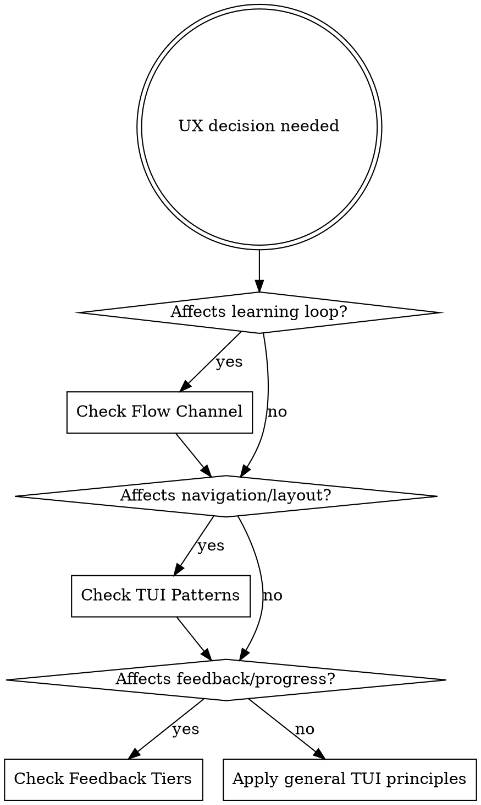

# UX for myro

myro is a competitive programming trainer. Every UX decision serves one goal: **keep the user in productive flow while maximizing learning.**

Two domains intersect: TUI design patterns and learning application psychology. This skill combines both.

## Decision Framework



## The Flow Channel

Csikszentmihalyi's challenge-skill balance is myro's core UX target. Too easy = boredom, too hard = anxiety.

**myro's implementation:** P(solve) targeting via logistic MF model. The 30-40% independent solve rate is the competitive programming sweet spot.

| User signal | Meaning | Response |
|-------------|---------|----------|
| Solves fast, no hints | Too easy | Increase difficulty (lower P(solve) target) |
| Solves with 1-2 hints | In the zone | Maintain current level |
| Stuck >10 min, multiple hints | Frustration risk | Offer `/isuck`, suggest easier related problem |
| Uses `/isuck` | Overwhelmed | Skip without shame, log for future spacing |

### Dynamic Difficulty Adjustment
- After AC: next problem auto-selected near target P(solve)
- After `/isuck`: pick easier problem in same skill area (scaffold down)
- After streak of 3+ ACs: nudge difficulty up slightly
- After streak of 2+ failures: nudge down, surface weaker prerequisite skills

## Zone of Proximal Development & Scaffolding

The coach hint system maps directly to Vygotsky's scaffolding:

```
Level 0: No help (user working independently)
Level 1: /hint → nudge ("think about edge cases")
Level 2: /hint → pointed question ("what happens when n=0?")
Level 3: /hint → partial formalization ("consider using prefix sums")
```

**Key principle:** Scaffolding is dynamic — withdraw support as competence grows.
- Track hint usage per skill area
- If user needed L3 hints last time on dp problems but solves next dp with L1 → progress
- If user never uses hints → they may be under-challenged (check P(solve))

## The TikTok Flow (Problem Loop)

```
[AC verdict] → [brief celebration + stats] → [next problem loads] → [solve]
     ↑                                                                  |
     └──────────── automatic, zero friction ────────────────────────────┘
```

**Transition design (post-solve):**

| Phase | Duration | Show |
|-------|----------|------|
| AC flash | 0-0.5s | Green "accepted" in status, brief color flash |
| Stats beat | 0.5-2s | Rating delta, skill delta, session count |
| Next load | 2-3s | Problem statement replaces editor content |

**Rules:**
- Never show a modal or "press enter to continue" — breaks flow
- Next problem appears automatically (like TikTok swipe)
- Stats beat gives the brain a micro-reward before next challenge
- Show session progress subtly (e.g., "problem 5 this session" in footer)

**Natural breakpoints** (ethical flow, not addictive scroll):
- After 30 min: subtle footer note "30 min — consider a break"
- After 10 problems: session summary popup (dismissible, not blocking)
- Always show session timer in status bar

## Feedback Tiers

Every action needs feedback at the right timescale:

| Tier | Timing | What | Where |
|------|--------|------|-------|
| Instant | <100ms | Keystroke echo, test pass/fail | Editor, test panel |
| Per-test | 1-5s | Individual test case result | Test runner output |
| Per-problem | On solve/skip | Rating change, skill delta, time taken | Status flash + stats beat |
| Per-session | On quit or breakpoint | Problems solved, accuracy, rating graph, skills practiced | Summary popup |
| Per-week | On app open | Streak count, skill growth, weak areas | Home screen or stats view |

**Celebrate proportionally:**
- Easy solve → minimal acknowledgment (green checkmark)
- Hard solve (low P(solve)) → stronger celebration (rating jump highlight)
- Streak milestone → brief achievement note
- Never over-celebrate in a TUI — keep it tasteful, one-line max

## TUI Layout Principles

### Panel Hierarchy (during solve)
```
┌─ problem statement ──────────────┐┌─ coach panel (3 lines) ─┐
│                                  ││ [coach message]          │
│  (primary: most screen space)    ││ [confidence dot]         │
│                                  ││ [thinking spinner]       │
├─ editor ─────────────────────────┤├──────────────────────────┤
│                                  ││ test output              │
│  (secondary: where user types)   ││ (tertiary: results)      │
│                                  ││                          │
└──────────────────────────────────┘└──────────────────────────┘
[footer: context-sensitive keybinding hints                     ]
```

**Rules:**
- Problem + editor get the most space (the learning task)
- Coach panel is compact, non-intrusive (pull-based, not push-based)
- Footer shows only 3-5 keys relevant to current context
- Popups dim background, Esc always closes
- Popup footer shows popup-specific shortcuts (not global ones)

### Navigation
- `j/k` everywhere for vertical movement
- `g/G` for top/bottom
- `Tab`/`Shift+Tab` to cycle panels
- `/` for command mode (intercepted before edtui)
- `Esc` always means "back" or "close"
- `q` quits current view, double `Ctrl+C` quits app

### Focus Indication
- Active panel: bright/colored border (use theme.rs)
- Inactive: dim border
- Selected item: highlight bar
- Mode indicator: show current vim mode in status

## Visual Design Rules

**Color is semantic, never decorative:**

| Color | Meaning |
|-------|---------|
| Green | Success, AC, active |
| Red | Error, WA, danger |
| Yellow | Warning, TLE, pending |
| Dim/grey | Secondary info, inactive |
| Accent (theme) | Focus, selection, interactive |

**Typography:**
- Left-align text, right-align numbers
- Truncate with `…` (use `truncate_at_char_boundary`, never raw byte slice)
- 1-char padding inside panels
- Single-line borders default, highlight border on focus

**Status indicators:**
- Spinner for in-flight operations (coach thinking, problem loading)
- Confidence dots (coach panel)
- Progress bars for continuous values
- Color-coded verdict badges (AC/WA/TLE/RE)

## Discoverability Ladder

Users learn myro's commands progressively:

1. **Footer hints** — always visible, context-sensitive (3-5 most relevant keys)
2. **`/help` overlay** — full command reference, scrollable
3. **`/debug`** — power user tool for session introspection
4. **Config file** — `~/.config/myro/config.toml` for deep customization

**Onboarding (first run):**
- Ask CF handle → validate → fetch history → fit model → first recommendation
- Immediate value within 60 seconds
- Teach `/run` first, introduce `/hint` and `/coach` only when user gets stuck
- Never front-load a tutorial — teach through doing

## Motivation Architecture

**Intrinsic (primary, sustainable):**
- Mastery: "I solved a harder problem than yesterday"
- Autonomy: user controls difficulty target, skill focus
- Curiosity: novel problems, algorithmic insights via coach

**Extrinsic (supporting, not primary):**
- Rating progression (Glicko-2 per skill)
- Solve streaks
- Skill tree unlocks (prerequisite DAG)
- Session stats

**Fail states — always provide an exit:**
- `/isuck` — shame-free skip, problem logged for future retry at lower difficulty
- `/hint` — graduated help, not "just try harder"
- Coach detects stalling → proactive gentle nudge
- After failure: suggest what to study, recommend easier related problem

## Anti-Patterns (myro-specific)

| Don't | Why | Instead |
|-------|-----|---------|
| Modal "are you sure?" on problem skip | Breaks flow, adds friction | Just skip, log it |
| Show all stats during solve | Distracts from the task | Stats only in summary/transition |
| Push coach messages unsolicited | Interrupts thinking | Coach is pull-based (user requests) |
| Hide difficulty/rating | User can't calibrate effort | Show P(solve) or difficulty tier |
| Require mouse for anything | TUI users expect keyboard-only | Every action has a keybinding |
| Silent test failures | User doesn't know what happened | Always show test output with verdict |
| Block UI during network calls | Feels broken | Background thread + spinner |
| Over-celebrate easy solves | Feels patronizing | Proportional feedback |

## Quick Reference: Key UX Decisions

| Decision | myro's choice | Rationale |
|----------|---------------|-----------|
| Problem selection | Algorithmic (P(solve) target) | Flow channel optimization |
| Post-solve transition | Automatic, zero-friction | TikTok flow |
| Hint system | 3-level ladder, pull-based | ZPD scaffolding |
| Difficulty adjustment | Dynamic via prediction model | Maintain flow channel |
| Session boundaries | Soft (timer + suggestions) | Ethical engagement |
| Error display | Inline, human-readable | Don't break flow for non-fatal |
| Theme/colors | Centralized in theme.rs | Consistency, semantic color |
| Keybindings | Vim-native conventions | Target audience expectation |
